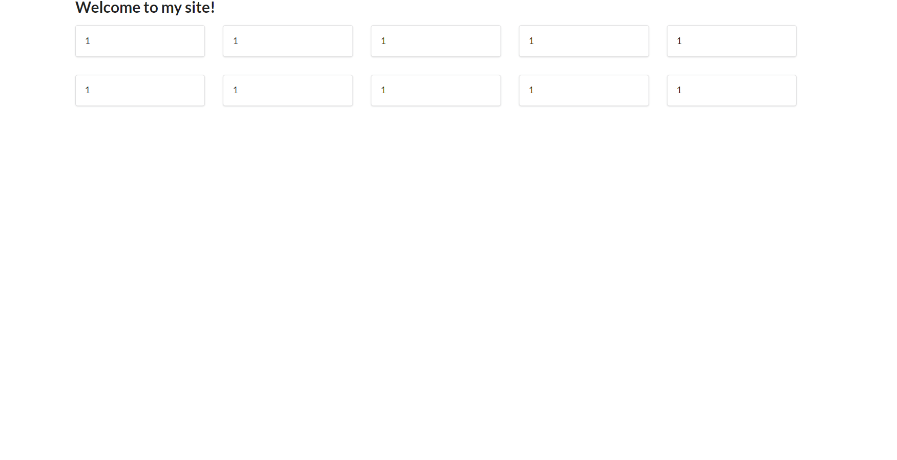
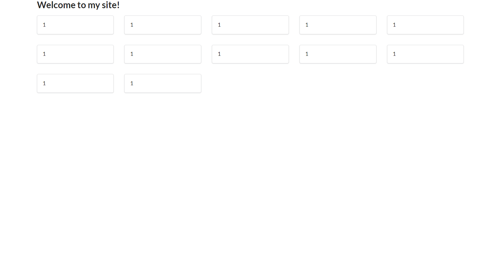
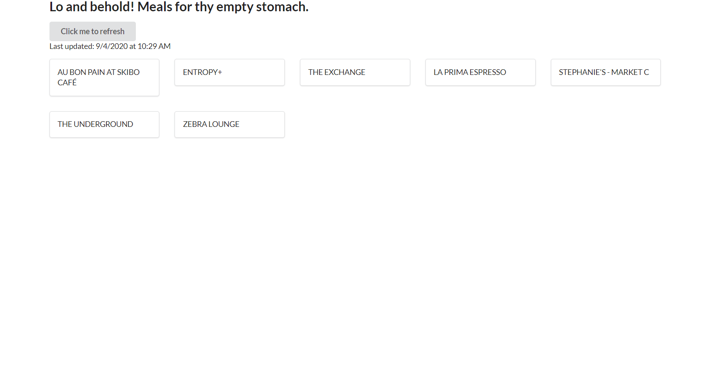

# WDW 2020 React Lab

Welcome to WDW 2020! We are glad that you can join us!

Today, we will be going over the creation of a simple React app that displays information retrieved from a backend. If you did not attend the previous talk about RESTful APIs with Node.js, you may use the common API instance given later in the lab.

We will be creating a small web application that will display all open dining locations at CMU. (A simplified version of **[cmu:eats](https://cmueats.com/)**, which is also built in React 😀)

This repository contains the completed result. As we go through the lab, we will be starting from scratch, so you do not need to clone this repository.

## Table of contents

1. [Setup Instructions](#setup-instructions)
2. [Creating your React project](#creating-your-react-project)
3. [Planning our project](#planning-our-project)
4. [Let's Begin](#lets-begin)
  a. [Importing a component Library](#importing-a-component-library)
  b. [Creating a component](#creating-a-component)
5. [Querying the API (backend)](#querying-the-api-backend)
  a. [How do we query the backend?](#how-do-we-query-the-backend)
  b. [Storing the data](#storing-the-data)
6. [Button to Retrieve New Data](#button-to-retrieve-new-data)
7. [Clean Up](#clean-up)
8. [Things to explore](#things-to-explore)

## Setup Instructions

If you have already completed this step, skip to the next section.

Here is the software that you need for this lab:

* [Node.js](https://nodejs.org/en/) version 12.19.0 LTS
* A text editor of your choice (e.g. VS Code, Sublime, Atom, vim, Notepad, etc.)
* A web browser. Chrome or Firefox is easier to work with. Here are some examples:
	* Google Chrome
	* Microsoft Edge (Chromium)
	* Mozilla Firefox
* The React Dev Tools extension
	* [Chrome Web Store](https://chrome.google.com/webstore/detail/react-developer-tools/fmkadmapgofadopljbjfkapdkoienihi?hl=en) (for Chromium)
	* [Firefox Browser Add-ons](https://addons.mozilla.org/en-US/firefox/addon/react-devtools/) (for Firefox)
	* [NPM](https://www.npmjs.com/package/react-devtools) (for everything else like Safari -- why? 😢)*

> If you are trying to do this and it does not work, for your sanity, use Chromium/Firefox.

If you are having any installation troubles, you may create a ticket on the mentor queue and we'll try to help as best we can.

## Creating your React project

Open a terminal window and navigate to the directory you wish to create your React project in. Then, run this command, which will automatically set up your workspace.

```
$ npx create-react-app wdw-app
```
Test to see if it runs:
```
$ cd wdw-app
$ npm start
```
It should automatically open a browser window to your app like so:

Open a code editor window in this directory. Here is an overview of the files you'll find in this folder.
```
. (/wdw-app)
├── node_modules
├── public
│   ├── favicon.ico
│   ├── index.html
│   └── ...
├── src
│   ├── ...
│   ├── App.js
│   ├── index.js
│   └── ...
├── .gitignore
├── package-lock.json
├── package.json
└── README.md
```
Folders:
* `./node_modules`: folder containing all of the Node.js modules that are installed for this project
* `./public`: publicly available assets, HTML, images, etc.
* `./src`: development directory. This is where we will build our React site.
Files:
* `./src/App.js`: Main App file that contains the default page component for create-react-app.
* `./src/index.js`: Main JS file that handles the binding of the React components to the DOM. We will not be touching this file.

> We refer to the project's root directory as `.` or `./`. This just a shortcut to the location of the `wdw-app` folder. So if I say `./src`, then I mean the directory named `src` inside the `wdw-app` directory.

## Planning our project

Our project will consist of a page header with a container that has all of the cards displayed in a grid. Each card will contain the name of the dining location that is open at this moment. To also make our lives easier, we will not make it real-time. Instead, we will use a simple button that refreshes the page with new data if there is any.

Now, to make our lives easier, we do not want to dabble too much in CSS (this is a React lab after all). We can use an HTML/CSS framework that provides React components (also called **Component Libraries**), specifically [Semantic UI](https://react.semantic-ui.com/). There are also some other exciting ones to check out:
* [React Bootstrap](https://react-bootstrap.github.io/)
* [Material UI](https://material-ui.com/)

I chose Semantic UI over the other simply because it has extensive documentation and use case examples that are very helpful for beginners.

## Let's Begin

Let us start with the easiest portion first. Figuring out how our data will be used and laid out on the page. This is simple with Semantic UI. Now, we just have to make sure that we leverage React's modularity.

Take a look inside your `./src` directory. Now, we want to create a new directory inside called `components`. We will store all of our small components here in `./src/components`.

Now go to `./src/App.js`. We want to clear everything to make room for our site. It should now look something like this:

```jsx
import React from  'react';

function App()  {
  // Our code will go here! :-)
}

export default App;
```

#### Importing a component library

Let us now build the layout with Semantic UI. First, we need to install it via NPM (node package manager).
```
$ npm install semantic-ui-react semantic-ui-css
```
First, we import the stylesheets into our `index.js` file and replace the old CSS:
```jsx
import React from 'react';
import ReactDOM from 'react-dom';
import 'semantic-ui-css/semantic.min.css';
import App from './App';
import * as serviceWorker from './serviceWorker';

ReactDOM.render(
  <React.StrictMode>
    <App />
  </React.StrictMode>,
  document.getElementById('root')
);

// If you want your app to work offline and load faster, you can change
// unregister() to register() below. Note this comes with some pitfalls.
// Learn more about service workers: https://bit.ly/CRA-PWA
serviceWorker.unregister();
```

And then, we can import components from it in our `App.js` file:
```jsx
import React from 'react';
import { Container, Grid, Header, Segment } from 'semantic-ui-react';

function App()  {
  
  return (
    <Container>
      <Header as='h2'>Welcome to my site!</Header>
      <Grid columns={5}>
        <Grid.Row>
          <Grid.Column>
            <Segment>1</Segment>
          </Grid.Column>
          <Grid.Column>
            <Segment>1</Segment>
          </Grid.Column>
          <Grid.Column>
            <Segment>1</Segment>
          </Grid.Column>
          <Grid.Column>
            <Segment>1</Segment>
          </Grid.Column>
          <Grid.Column>
            <Segment>1</Segment>
          </Grid.Column>
        </Grid.Row>
      </Grid>
      <Grid columns={5}>
        <Grid.Row>
          <Grid.Column>
            <Segment>1</Segment>
          </Grid.Column>
          <Grid.Column>
            <Segment>1</Segment>
          </Grid.Column>
          <Grid.Column>
            <Segment>1</Segment>
          </Grid.Column>
          <Grid.Column>
            <Segment>1</Segment>
          </Grid.Column>
          <Grid.Column>
            <Segment>1</Segment>
          </Grid.Column>
        </Grid.Row>
      </Grid>
    </Container>
  );
}

export default App;
```
> Remember that we can generate sections of HTML tags and React components inside a JSX expression. We can return this expression (as we did above) to render it as a component.

Great! It should look something like this:



We have two rows of cards which all say 1.

#### Creating a component

Now let's make this into a component which will take in a specific number and create a grid with that number of cards. Create a new file `./src/components/CreateGrid.js`. Now that we are creating a new file, we can follow a general template:

```jsx
import React from 'react';

const CreateGrid = (props) => {

};

export default CreateGrid;
```

Let us find a general pattern: every row of cards contains 5 cards. The creation of these rows is predictable. Try to think of how to go about this algorithmically. HINT: React can render an array of JSX expressions and also to add to the end of an array, we do `array.push(element)`.

> More info in the [React Docs](https://reactjs.org/docs/jsx-in-depth.html#jsx-children).

Thought about it?

<details>
  <summary>Spoiler warning: Okay so here is <i>one</i> solution (there are many possible ones):</summary>
  
  ```jsx
  import React from 'react';
  import { Grid, Segment } from 'semantic-ui-react';

  const CreateGrid = (props) => {
    const segment = (
      <Grid.Column>
        <Segment>1</Segment>
      </Grid.Column>
    );

    const count = props.count || 0; // For safety
    
    const rows = Math.ceil(count / 5);
    const lastRowCount = count % 5 || 5; // If 0, use 5 instead

    // First n-1 rows
    const result = [];
    for (var i = 1; i < rows; i++) {
      const innerRow = [];
      for (var j = 0; j < 5; j++) {
        innerRow.push(segment);
      }
      const row = (
        <Grid.Row>
          {innerRow}
        </Grid.Row>
      );
      result.push(row);
    }

    if (rows !== 0) {
      // Last row
      const innerRow = [];
      for (var k = 0; k < lastRowCount; k++) {
        innerRow.push(segment);
      }
      const row = (
        <Grid.Row>
          {innerRow}
        </Grid.Row>
      );
      result.push(row);
    }

    return result;
  };

  export default CreateGrid;
  ```
</details><br />

Now, let's modify our `App.js` to use this instead. First, import the component and place it in the JSX expression.

```jsx
import CreateGrid from './components/CreateGrid';
```

and

```jsx
<CreateGrid count={12} />
```

We're going to use this later once we have the data. :-)

This is what you just built!



Feel free to play around with the components with React Dev Tools. (Inspect Element > >> button (top bar) > ⚛ Components)

Still with me? You're doing great!

## Querying the API (backend)

Now, we're ready for the data! Since we want to know what dining locations are
open at any given time, we specifically need the `https://apis.scottylabs.org/dining/location/time/{day}/{hour}/{min}` endpoint.

> You can explore the Dining API at the [ScottyLabs API Website](https://apis.scottylabs.org/)

You do not need to understand how the API backend works. Only that it takes in three parameters:
* day (0-6, with 0 - Sunday, 6 - Saturday)
* hour (in 24 hour notation)
* min

and it returns an array with the following schema:

```json
[
  {
    "name": "string",
    "short_description": "string",
    "description": "string",
    "location": "string",
    "coordinates": {
      "lat": 0,
      "lng": 0
    },
    "times": [
      {
        "start": {
          "day": 0,
          "hour": 0,
          "minute": 0
        },
        "end": {
          "day": 0,
          "hour": 0,
          "minute": 0
        }
      }
    ]
  }
]
```
> JSON is perfect for JavaScript because it stands for JavaScript Object Notation.
> In fact, when assigned to a variable in JS, it is parsed as an object!

#### How do we query the backend?

This is where NPM packages come in. We can use code that other developers have already written for us. Here, we use axios to handle our requests.

```
$ npm install axios
```
Now, where do we call our request function in React? Note that React is rendered in the browser, so there isn't really any procedural way of calling a function without rerendering the page.

Unless we take advantage of a page render to call our functions. Lifecycle methods!

We import both `axios` and the `useEffect` hook in our `App.js` file so that we can use them in our `App` component.

```jsx
import React, { useEffect } from  'react';
import { Container, Grid, Header, Segment } from 'semantic-ui-react';
import CreateGrid from './components/CreateGrid';
import axios from 'axios';
```

Now let's make a function inside `App` that allows you to query the API. Here is an example which allows us to log the value of the response to the console. The function is also called by `useEffect`.

A little explanation on how the `useEffect` works. The `useEffect` function takes in 1 or 2 arguments. The first argument is always a function that is called when the `useEffect` is called. The second argument is optional but is an array when it is provided. When only 1 argument is passed, the function is **always** called when something changes, e.g. state, props, rerender, etc. When two arguments are passed, the function is only called when the values of the array contents changes.

```javascript
useEffect(functionToCall, [checkIfIChange, checkIfIChangeToo]);
```

We can set `useEffect` to only call once (when the page renders) by specifying an empty array as the second argument as shown in the example below. (An empty array never changes!)

> To learn more about hooks, you may visit the [React Docs](https://reactjs.org/docs/hooks-intro.html).

```jsx
function App()  {
  const retrieveData = () => {
    const date = new Date(Date.now());
    const day = date.getDay();
    const hours = date.getHours();
    const mins = date.getMinutes();

    const requestURL = `https://apis.scottylabs.org/dining/location/time/${day}/${hours}/${mins}`;

    axios.get(requestURL).then((response) => {
      console.log(response);
    });
  };

  useEffect(retrieveData, []);

  // ...
}
```

#### Storing the data

What if I want to use the data instead of putting it in the web browser's console? That's what state is for!

> **Why use state when we can declare local variables?**
> Every time the component is rendered, all variables are reassigned. The only
> variable with persistent state is, well, a state variable.

We can declare a state variable with the `useState` hook. It takes in an argument which is set as the initial value of the state. The return value is an array with exactly two elements. The first is always the variable where we can access the state's value. The second is always the function that sets the value of the state.

```javascript
const [name, setName] = useState('John'); // Sets initial value of name to John
```

Like before, we must also import the `useState` hook.

> To learn more about hooks, you may visit the [React Docs](https://reactjs.org/docs/hooks-intro.html).

```jsx
import React, { useEffect, useState } from  'react';
import { Container, Grid, Header, Segment } from 'semantic-ui-react';
import CreateGrid from './components/CreateGrid';
import axios from 'axios';

function App()  {
  const [data, setData] = useState([]);

  const retrieveData = () => {
    const date = new Date(Date.now());
    const day = date.getDay();
    const hours = date.getHours();
    const mins = date.getMinutes();

    const requestURL = `https://apis.scottylabs.org/dining/location/time/${day}/${hours}/${mins}`;

    axios.get(requestURL).then((response) => {
      setData(response.data);
    });
  };

  useEffect(retrieveData, []);

  return (
    <Container>
      <Header as='h2'>Lo and behold! Meals for thy empty stomach.</Header>
      <Grid columns={5}>
        <CreateGrid locations={data} />
      </Grid>
    </Container>
  );
}

export default App;
```

> Tip: You can view the state of a component with React Dev Tools!

Now let's pass this data into our `CreateGrid` component. We have to modify
`CreateGrid` slightly to accommodate this new data type. We might have to move
some things around so we can set the values properly. Take note of count and
segment.

```jsx
const CreateGrid = (props) => {
  let count;

  // Count is now the length of the locations array
  if (props.locations) {
    count = props.locations.length;
  } else {
    count = 0;
  }
  
  const rows = Math.ceil(count / 5);
  const lastRowCount = count % 5 || 5; // If 0, use 5 instead

  let index = 0;

  // First n-1 rows
  const result = [];
  for (var i = 1; i < rows; i++) {
    const innerRow = [];
    for (var j = 0; j < 5; j++) {
      const locationName = props.locations[index].name;
      // We move this in so that we can insert the value
      const segment = (
        <Grid.Column>
          <Segment>{locationName}</Segment>
        </Grid.Column>
      );
      innerRow.push(segment);
      index++;
    }
    const row = (
      <Grid.Row>
        {innerRow}
      </Grid.Row>
    );
    result.push(row);
  }

  if (rows !== 0) {
    // Last row
    const innerRow = [];
    for (var k = 0; k < lastRowCount; k++) {
      const locationName = props.locations[index].name;
      // We move this in so that we can insert the value
      const segment = (
        <Grid.Column>
          <Segment>{locationName}</Segment>
        </Grid.Column>
      );
      innerRow.push(segment);
      index++;
    }
    const row = (
      <Grid.Row>
        {innerRow}
      </Grid.Row>
    );
    result.push(row);
  }

  return result;
};
```

It works!! The dining locations are now visible there. You should at least
see "STEPHANIE'S - MARKET C" (open 24 hours) in the list.

> Beware of infinite loops! A `useEffect` that checks for changes in a state variable that it has mutated inside the function call will cause an infinite loop.
> ```javascript
> useEffect(() => {
>   setData({}) // Called function causes a re-render (state was changed).
> }, [data]); // Checks if this has changed since render. (Yes, so call function)
> ```
> Remember that if you do not specify an array (no second argument), `useEffect` checks for all changes.

## Button to Retrieve New Data

This is much simpler than what we have already done. We can import a `Button` component from Semantic UI and set its `onClick` event handler to call `retrieveData`.

> For more about events, you may visit the [React Docs](https://reactjs.org/docs/handling-events.html).

Here is an example of how it can be used.

```jsx
import React, { useEffect, useState } from  'react';
import { Button, Container, Grid, Header, Segment } from 'semantic-ui-react';
import CreateGrid from './components/CreateGrid';
import axios from 'axios';

function App()  {
  const [data, setData] = useState([]);
  const [updated, setUpdated] = useState(new Date(0));

  const retrieveData = () => {
    const date = new Date(Date.now());
    const day = date.getDay();
    const hours = date.getHours();
    const mins = date.getMinutes();

    const requestURL = `https://apis.scottylabs.org/dining/location/time/${day}/${hours}/${mins}`;

    axios.get(requestURL).then((response) => {
      setData(response.data);
      setUpdated(date);
    });
  };

  const timeString = (date) => {
    const day = date.getDay();
    const month = date.getMonth();
    const year = date.getFullYear();
    let hour = date.getHours();
    const minutes = date.getMinutes();
    let period = 'AM';
    
    if (hour > 12) {
      hour = hour % 12;
      period = 'PM';
    }

    let minuteString = '';
    if (minutes < 10) {
      minuteString = minuteString + '0' + minutes;
    } else {
      minuteString = minutes;
    }

    return `${month}/${day}/${year} at ${hour}:${minuteString} ${period}`;
  }

  useEffect(retrieveData, []);

  return (
    <Container>
      <Header as='h2'>Lo and behold! Meals for thy empty stomach.</Header>
      <Button onClick={retrieveData}>Click me to refresh</Button>
      <p>Last updated: {timeString(updated)}</p>
      <Grid columns={5}>
        <CreateGrid locations={data} />
      </Grid>
    </Container>
  );
}

export default App;
```

Yes. I added a lot of stuff, so let me explain. Take note of the `<Button>` tags in the returned JSX expression. I set the `onClick` event handler to call the `retrieveData` function which we already wrote earlier.

I also added a line of text that indicates what time the data was refreshed. This time is stored in a state variable as `updated`.

In addition, I wrote another function that takes the `updated` state variable and converts it into a human-readable time format.

It looks like this now:



## Clean Up

React does not like bad style. It uses ES Lint to check if there are unused
variables and whatnot. Now, we have this warning

```
Compiled with warnings.

./src/App.js
  Line 2:35:  'Segment' is defined but never used  no-unused-vars

Search for the keywords to learn more about each warning.
To ignore, add // eslint-disable-next-line to the line before.
```

We can go back to `App.js` and just remove `Segment` from our Semantic UI
import statement.

Et voilà! Warnings no more.

```
Compiled successfully!

You can now view wdw-react in the browser.

  Local:            http://localhost:3000
  On Your Network:  http://172.26.181.241:3000

Note that the development build is not optimized.
To create a production build, use npm run build.
```

## Things to explore

The possibilities are limitless. Here are some cool frameworks and libraries
that can supercharge your React apps:

* [Gatsby](https://www.gatsbyjs.com/)
* [Next.js](https://nextjs.org/)
* [Redux](https://redux.js.org/)

In addition, React Native lets you build mobile apps with the same syntax as
React.